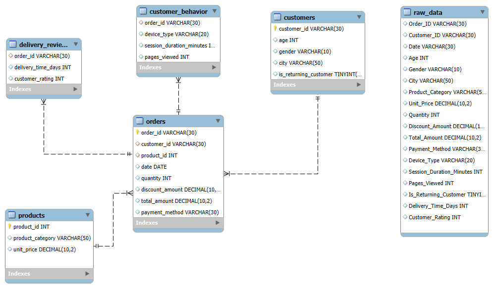

# 🛒 E-Commerce SQL Analytics Project

<div align="center">


**An end-to-end SQL analytics project analyzing e-commerce customer behavior, revenue trends, and operational metrics**

[View Notebook](Ecommerce-SQL-Analysis.ipynb) • [Dataset Source](https://www.kaggle.com) • [Report Issues](#)

</div>

---

## 📊 Project Overview

This project demonstrates a complete data analytics workflow from raw data to actionable business insights. Using **17,049 transactions** from a synthetic e-commerce dataset spanning **January 2023 to March 2024**, I designed a normalized database schema, performed ETL operations, and conducted comprehensive SQL-based exploratory data analysis to uncover revenue patterns, customer segments, and optimization opportunities.

### 💡 Key Business Findings

| Metric | Value | Insight |
|--------|-------|---------|
| **Total Revenue** | $21.78M | Baseline established for 15-month period |
| **Revenue Decline** | -20% (Dec '23 → Mar '24) | 🚨 Critical Q1 2024 trend requiring intervention |
| **Geographic Concentration** | 26% from Istanbul | 🚨 Over-reliance risk on single city |
| **Category Dominance** | Electronics = 48% revenue | High-value category driving business |
| **Customer Retention** | 93% returning customers | ✅ Strong loyalty but acquisition crisis (only 23 new customers/month) |
| **Mobile Opportunity** | $487K potential gain | Bridging 4% AOV gap between desktop and mobile |

---

## 🎯 Business Impact & Recommendations

### Critical Actions Identified:

1. **New Customer Acquisition Crisis** 🚨
   - Only 23 new customers/month vs. estimated 5% monthly churn
   - **Recommendation**: Triple acquisition efforts → 70+ customers/month
   - **Projected Impact**: +$2-3M annual revenue

2. **Mobile Optimization Opportunity** 💰
   - Mobile represents 56% of orders but 4% lower AOV than desktop
   - **Recommendation**: Implement Apple Pay, streamline checkout, add upsell modules
   - **Projected Impact**: +$487K annually from AOV increase alone

3. **Geographic Diversification** 🌍
   - Istanbul (26%), Ankara (14%), Izmir (12%) = 52% of revenue
   - **Recommendation**: Targeted campaigns in Tier 2 cities
   - **Projected Impact**: +$1-2M from market diversification

4. **Category Profitability Rebalancing** 📦
   - Low-value categories (Books, Food, Beauty) = 37% of units but only 7% of revenue
   - **Recommendation**: Reduce unprofitable SKUs, focus on high-value categories
   - **Projected Impact**: +$750K-1M annual profit improvement

**Total Potential Revenue Uplift: $5-7M (23-32% growth)**

---

## 🗂️ Database Schema & Architecture

### Entity-Relationship Design

The project implements a **normalized relational database** with proper foreign key constraints:

```
┌─────────────┐         ┌──────────┐         ┌──────────────────┐
│  customers  │         │ orders   │         │    products      │
├─────────────┤         ├──────────┤         ├──────────────────┤
│ customer_id │◄───────┤customer_id│         │   product_id     │
│ age         │         │product_id├────────►│product_category  │
│ gender      │         │   date    │         │   unit_price     │
│ city        │         │ quantity  │         └──────────────────┘
│ is_returning│         │total_amount│
└─────────────┘         │payment_method
                        └────┬────┘
                             │
                ┌────────────┴──────────────┐
                │                           │
        ┌───────▼────────┐      ┌──────────▼─────────┐
        │customer_behavior│      │ delivery_reviews   │
        ├────────────────┤      ├────────────────────┤
        │   order_id     │      │     order_id       │
        │  device_type   │      │delivery_time_days  │
        │session_duration│      │ customer_rating    │
        │  pages_viewed  │      └────────────────────┘
        └────────────────┘
```

### Tables & Purpose:

- **`customers`** - Unique customer profiles (5,000 customers)
- **`products`** - Product catalog with pricing (16,402 distinct products)
- **`orders`** - Transaction records (17,049 orders)
- **`customer_behavior`** - Session analytics (device, duration, pages viewed)
- **`delivery_reviews`** - Post-purchase metrics (delivery time, ratings)

---

## 🔍 SQL Techniques Demonstrated

This project showcases a variety of SQL skills relevant to data analyst roles:

### Basic to Intermediate:
- ✅ Aggregate functions (`SUM`, `AVG`, `COUNT`)
- ✅ JOINs (INNER, LEFT)
- ✅ GROUP BY with multiple dimensions
- ✅ Date formatting (`DATE_FORMAT`, `STR_TO_DATE`)
- ✅ Subqueries and CTEs (Common Table Expressions)
- ✅ CASE statements for conditional logic

### Advanced:
- ✅ Window functions for ranking
- ✅ Database normalization (1NF, 2NF, 3NF)
- ✅ Foreign key constraints
- ✅ ETL pipeline design
- ✅ Data quality validation

### Business Analytics:
- ✅ Customer Lifetime Value (CLV) calculation
- ✅ Cohort analysis framework
- ✅ Revenue trend analysis
- ✅ Customer segmentation
- ✅ Product performance metrics

---

## 📈 Key Analyses Performed

### 1. Revenue Analytics
- **Monthly Revenue Trends**: Identified 20% decline from Dec 2023 peak
- **Geographic Revenue Distribution**: Top 10 cities analysis
- **Category Performance**: 8 product categories ranked by revenue and volume

### 2. Customer Analytics
- **Lifetime Value (CLV)**: Top customers spending $40K+ identified
- **Retention Analysis**: 93% returning customers vs 7% new
- **Demographic Profiling**: Average age 35 years across all markets

### 3. Product Analytics
- **Best-Selling Categories**: Electronics dominating with $10.48M (48%)
- **Unit Economics**: Average unit price analysis revealing 31x price gap
- **Volume vs Revenue Disconnect**: High-volume categories with low revenue identified

### 4. Behavioral Analytics
- **Device Performance**: Mobile (56% orders), Desktop (higher AOV by 4%)
- **Session Analysis**: Average 9 pages viewed (80% above industry benchmark)
- **Engagement Metrics**: 14.5-minute average session duration

### 5. Operational Metrics
- **Average Order Value**: $1,263 per customer transaction
- **Order Frequency**: Returning customers average 3.6 orders
- **Payment Methods**: Distribution analysis across payment types

---

## 🛠️ Technical Stack

| Category | Technology |
|----------|-----------|
| **Language** | Python 3.13.2 |
| **Database** | MySQL 8.0.40 |
| **Data Processing** | Pandas, SQLAlchemy |
| **Database Connector** | PyMySQL |
| **SQL Interface** | IPython-SQL |
| **Development Environment** | VS Code with Jupyter Extension |
| **Version Control** | Git & GitHub |

---

## 📁 Project Structure

```
Ecommerce-SQL-Analysis/
│
├── Data/
│   └── ecommerce_customer_behavior_dataset_v2.csv    # Raw dataset (17,049 rows)
│
├── Ecommerce-SQL-Analysis.ipynb                      # Main analysis notebook
│
├── Images/                                           # Screenshots & visualizations
│   ├── schema_diagram.png
│   ├── top cities by revenue.png
│   └── best selling products categories.png
│
├── requirements.txt                                  # Python dependencies
│
├── README.md                                         # This file
│
└── .gitignore                                        # Excludes sensitive data
```

---

## 🚀 Getting Started

### Prerequisites

- Python 3.13+ installed
- MySQL 8.0+ installed and running
- Jupyter Notebook or VS Code with Jupyter extension
- Basic understanding of SQL and Python

### Installation Steps

1. **Clone the Repository**
   ```bash
   git clone https://github.com/yourusername/Ecommerce-SQL-Analysis.git
   cd Ecommerce-SQL-Analysis
   ```

2. **Install Python Dependencies**
   ```bash
   pip install -r requirements.txt
   ```

   Or manually install:
   ```bash
   pip install pandas sqlalchemy pymysql ipython-sql jupyter
   ```

3. **Set Up MySQL Database**
   
   Create a new database:
   ```sql
   CREATE DATABASE ecommerce_project;
   ```

4. **Configure Database Connection**
   
   ⚠️ **Security Note**: Never commit credentials to GitHub!
   
   Create a `.env` file (already in `.gitignore`):
   ```env
   DB_USER=your_mysql_username
   DB_PASSWORD=your_mysql_password
   DB_HOST=localhost
   DB_PORT=3306
   DB_NAME=ecommerce_project
   ```

   Update notebook connection:
   ```python
   import os
   from dotenv import load_dotenv
   
   load_dotenv()
   
   engine = create_engine(
       f"mysql+pymysql://{os.getenv('DB_USER')}:{os.getenv('DB_PASSWORD')}@{os.getenv('DB_HOST')}:{os.getenv('DB_PORT')}/{os.getenv('DB_NAME')}"
   )
   ```

5. **Run the Notebook**
   ```bash
   jupyter notebook Ecommerce-SQL-Analysis.ipynb
   ```
   
   Or open in VS Code and run cells sequentially.

6. **Load Data**
   - The notebook will automatically create tables and load data from CSV
   - First run creates schema, subsequent runs append data (modify `if_exists` parameter if needed)

---

## 📊 Sample Queries

### Revenue by City (Top 10)
```sql
SELECT 
    c.city,
    SUM(o.total_amount) AS total_revenue
FROM orders o
JOIN customers c ON o.customer_id = c.customer_id
GROUP BY c.city
ORDER BY total_revenue DESC
LIMIT 10;
```

### Customer Lifetime Value
```sql
SELECT 
    customer_id,
    SUM(total_amount) AS lifetime_value,
    COUNT(order_id) AS total_orders,
    AVG(total_amount) AS avg_order_value
FROM orders
GROUP BY customer_id
ORDER BY lifetime_value DESC
LIMIT 10;
```

### Monthly Revenue Trend
```sql
SELECT 
    DATE_FORMAT(date, '%Y-%m') AS month,
    SUM(total_amount) AS revenue
FROM orders
GROUP BY month
ORDER BY month;
```

---

## 📸 Visualizations

### schema_diagram

*Shows the table structure*

### top cities by revenue


### best selling products categories


---

## 🎓 Key Learnings

### Technical Skills Developed:
- ✅ Designed and implemented normalized database schema
- ✅ Built ETL pipeline from CSV to MySQL
- ✅ Wrote complex SQL queries with JOINs, CTEs, and aggregations
- ✅ Performed comprehensive business analysis

### Business Skills Developed:
- ✅ Revenue trend analysis and forecasting
- ✅ Customer segmentation and CLV calculation
- ✅ Product portfolio optimization
- ✅ Data-driven recommendation frameworks

### Analytical Thinking:
- ✅ Identified hidden patterns (unit economics of low-value categories)
- ✅ Quantified business impact ($5-7M opportunity)
- ✅ Balanced technical analysis with business context

---

## 🔮 Future Enhancements

### Phase 1: Visualization Layer (In Progress)
- [ ] **Power BI Dashboard** - Interactive executive dashboard
- [ ] **Tableau Public** - Geographic revenue heatmap
- [ ] **Python Visualizations** - Matplotlib/Seaborn charts in notebook

### Phase 2: Advanced Analytics
- [ ] **RFM Segmentation** - Recency, Frequency, Monetary customer clusters
- [ ] **Cohort Analysis** - Track customer acquisition cohorts over time
- [ ] **Churn Prediction** - Identify at-risk customers using ML
- [ ] **Market Basket Analysis** - Product affinity and cross-sell opportunities

### Phase 3: Automation & Deployment
- [ ] **Automated ETL Pipeline** - Airflow or scheduled Python scripts
- [ ] **Real-time Dashboard** - Streamlit web application
- [ ] **Alert System** - Automated reports for anomaly detection

---

## 📚 Dataset Information

**Source**: [Kaggle - E-Commerce Customer Behavior Dataset](https://www.kaggle.com)

**Type**: Synthetic data designed to mimic real-world e-commerce transactions

**Period**: January 2023 - March 2024 (15 months)

**Records**: 17,049 transactions

**Features**: 
- Customer demographics (age, gender, city)
- Order details (date, quantity, amount, payment method)
- Behavioral data (device type, session duration, pages viewed)
- Post-purchase metrics (delivery time, customer rating)

**License**: Public domain (synthetic data)

---

## 🤝 Contributing

This is a portfolio project, but feedback and suggestions are welcome!

1. Fork the repository
2. Create a feature branch (`git checkout -b feature/improvement`)
3. Commit your changes (`git commit -m 'Add improvement'`)
4. Push to branch (`git push origin feature/improvement`)
5. Open a Pull Request

---

## 📧 Contact

**Your Name**  
📧 Email: akhilak8752@gmail.com  
💼 LinkedIn: [linkedin.com/in/yourprofile](https://linkedin.com/in/akhil8752)

---

## 📄 License

This project is licensed under the MIT License - see the [LICENSE](LICENSE) file for details.

---

## 🙏 Acknowledgments

- **Dataset**: Kaggle community for synthetic e-commerce dataset
- **Inspiration**: Real-world e-commerce analytics practices
- **Learning Resources**: SQL documentation, data analytics best practices
- **AI Assistance**: Markdown formatting, documentation structure, and analytical guidance were supported by AI tools including Claude and ChatGPT.


---

## 💼 Portfolio Note

This project demonstrates:
✅ **SQL Proficiency** - Complex queries, database design, optimization  
✅ **Business Acumen** - Translating data into actionable insights  
✅ **ETL Skills** - Data pipeline from raw CSV to structured database  
✅ **Analytical Thinking** - Identifying patterns and opportunities  
✅ **Communication** - Clear documentation and visualization  

**Suitable for**: Data Analyst, Business Analyst, BI Analyst positions

---

<div align="center">

**⭐ If you found this project helpful, please consider giving it a star!**

Made with ❤️ by [Akhil]

</div>
